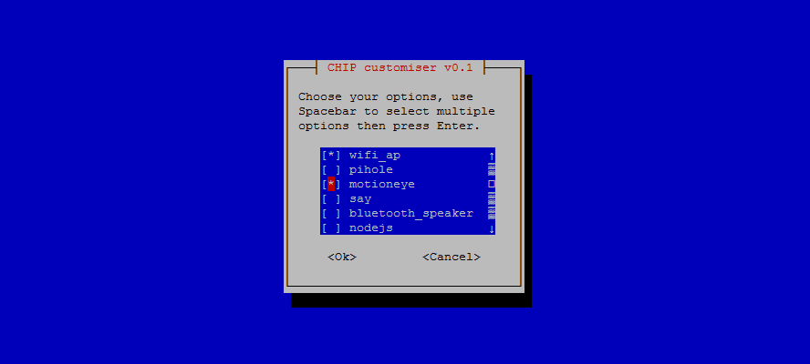

# CHIP Customiser
Various bash scripts for NTC CHIP using whiptail menus, tested with 4.4.13-ntc-mlc headless image.



## Run
Login as `root` (or `sudo su`) and run with:
```
bash <(curl -sL https://rawgit.com/norgeous/CHIP-customiser/master/RUNME.sh)
```

## What options are available

### update.sh
* Performs a system update.
* Performs a system upgrade.
* Autoremoves unused package.

### first_run.sh
* Change default hostname.
* Change default username and password.
* Disable root password.
* Configure Locale and Timezone.
* Reduce swappiness (to protect NAND a bit).
* Enable the `ll` command.

### install_nginx_router.sh
* Install `nginx` on port 80.
* Install `php5-fpm`.
* Adds a jump off point for other services - a page that lists all open ports and provides reboot and shutdown buttons.
* Can be accesed via http://router.admin/ when using wifi_ap.sh.

### install_pihole.sh
* Network wide adblocker using DNS installed to port 8080.

### install_motioneye.sh
* Cheap CCTV camera.

### install_say.sh
* Install Android's local TTS engine.
* create wrapper for TTS engine as `say` command.

### install_nodejs.sh
* Install node js 7
* https://nodejs.org/en/download/package-manager/#debian-and-ubuntu-based-linux-distributions

### install_wetty.sh
* Installs browser acessable tty through npm and sets a systemd service on port 2222.
* https://github.com/krishnasrinivas/wetty

### install_syncthing.sh
* Install Syncthing (File syncronisation tool) and repos.
* https://syncthing.net/

### install_button_menu.sh
* Use chip's built-in button and status led to control chip (WIP).

### wifi_ap.sh
* Broadcast wifi ap on wlan1.
* Enable nat forwarding.
* CHIP acts as router (if wlan0 is connected to the internet).

### bluetooth_speaker.sh
* Connect a blutooth speaker.
* Setup a systemd to reconnect it on reboot.
* Use `systemctl restart speaker` to reconnect speaker manually.

## CHIP flashing quick reference
1. Connect the FEL - GND wire.
2. Flash the CHIP with headless from the Chrome flasher at http://flash.getchip.com/.
3. Power off the CHIP (hold button for 7 seconds).
4. Remove FEL - GND wire.
5. Power on the CHIP (hold button for 1 second).
6. Wait for CHIP to boot.
7. Launch putty and connect to COM port (find with Device Manager).
8. Connect to you home wifi internet with either of these:
```
nmtui
nmcli d wifi connect "Netgear" password "12345678" ifname wlan0
```
9. Use `ifconfig` to find the CHIP's IP address
10. Exit putty
11. You can now connect to the CHIP over the local network (using putty or `ssh`)
